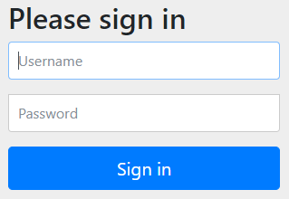

# Spring Security in Spring Boot

### Project Setup

>### * Modules used for Application 

 * Java 8
 * Spring Boot
 * H2 database
 * Maven
 * Git

>### * Added Dependency 

 * Web
 * JPA
 * H2
 * DevTool
 * Spring Security 
 * Thymeleaf 
 
>### * application.properties

	# Configure H2 database
	spring.datasource.url=jdbc:h2:mem:testdb
	spring.datasource.driverClassName=org.h2.Driver
	spring.datasource.username=sa
	spring.datasource.password=
	spring.jpa.database-platform=org.hibernate.dialect.H2Dialect

**Note :** We can get the records on /h2-console to manage the database. 

### * Created API

There are created three API. First two is for User role and the last and third one is created for Admin role.

1. Find the User by UserId - USER_ROLE
	
	> http://localhost:8080/api/user/1
2. Find the User By Username - USER_ROLE
	
	> http://localhost:8080/api/user?username=vikash
3. Find All User details. - ADMIN_ROLE

	> http://localhost:8080/api/admin/user
	
**Note :** data.sql file is created for insert user details in user table at initial time.

### * Spring Security Dependency

	<dependency>
		<groupId>org.springframework.boot</groupId>
		<artifactId>spring-boot-starter-security</artifactId>
	</dependency>
	
As you will add the Spring-boot-starter-security, the whole application will be secure that means, you can't access any page or Url without given Username and Password.
The Spring security will give the default login page with default url **/login**. e.g - [http://localhost:8080/login](http://localhost:8080/login) 

The Username will be by default **user** and we can get the password from console, given like that : 

	  Using generated security password: 937e8fe0-cff5-4b1c-bc00-59c3c44d6c2a
	  
You can customize the **Username** and **password** from **application.properties** which is given below :

	spring.security.user.name= vikash
	spring.security.user.password= pass

### * Security in a Spring MVC Application

We can either implements the interface called WebSecurityConfigurer or extend the more convenient class called WebSecurityConfigurerAdapter. The advantage of extending the adapter class is that we can configure Web security by overriding only those parts that we are interested in; others can remain their default form.

	// The annotation @EnableWebSecurity enables Web security; otherwise, it remains disabled by default.
	@Configuration
	@EnableWebSecurity
	public class SecurityConfig extends WebSecurityConfigurerAdapter {
	}

**There are three different type of the configure method that can be override to configure and secure the application :**

* void configure( AuthenticationManagerBuilder auth): To configure user details services
* void configure( HttpSecurity http): To configure how requests are secured by interceptors
* void configure( WebSecurity web): To configure Spring Security's filter chain

> **configure( AuthenticationManagerBuilder auth)**

	@Override
	protected void configure(AuthenticationManagerBuilder auth) throws Exception {
	
		auth.inMemoryAuthentication()
			.withUser("admin").password("{noop}pass").roles("ADMIN");
			.and()
			.withUser("user").password("{noop}pass").roles("USER")
	}
	
> **configure( HttpSecurity http)**

	@Override
	protected void configure(HttpSecurity http) throws Exception {

		http.cors().disable()
			.authorizeRequests().antMatchers("/api/admin/**").hasAnyRole("ADMIN")
			.and().authorizeRequests().antMatchers("/api/user/**").hasAnyRole("USER")
			.and().formLogin();
	}
	
> **configure( WebSecurity web)**

**Note :** The default filter chain is fine for most needs.

### * UserDetailsService userDetailsService(); 
 
* Core interface which loads user-specific data. 
* It is used throughout the framework as a user DAO and is the strategy used by the DaoAuthenticationProvider.
* The interface requires only one read-only method, which simplifies support for new data-access strategies.
* It can be use **UserDetailsService userDetailsService()** in place of **void configure(AuthenticationManagerBuilder auth)**

> Way to use UserDetailsService interface

	@Bean
	@Override
	public UserDetailsService userDetailsService() {

		/* Create single User */
		// UserDetails userDetails = User.withDefaultPasswordEncoder().username("vikash").password("pass").roles("USER").build();

		// Create multiple User
		List<UserDetails> userDetails = new ArrayList<>();
		userDetails.add(User.withDefaultPasswordEncoder().username("user").password("pass").roles("USER").build());
		userDetails.add(User.withDefaultPasswordEncoder().username("admin").password("pass").roles("ADMIN").build());

		return new InMemoryUserDetailsManager(userDetails);
	}	 

### * Login through Database

> AuthenticationProvider vs UserDetailsService

UserDetailsService is not an alternative to AuthenticationProvider but it is used for a different purpose i.e. to load user details. Typically, an AuthenticationProvider implementation can use UserDetailsService instance to retrieve user details during its authentication process. For example, DaoAuthenticationProvider, in case of JDBC-authentication, uses JdbcUserDetailsManager as an implementation of UserDetailsService. In case of in-memory authentication, DaoAuthenticationProvider uses InMemoryUserDetailsManager implementation. [more details](https://www.logicbig.com/tutorials/spring-framework/spring-security/user-details-service.html)

	@Autowired
	private UserDetailsService userDetailsService;
	
	@Bean
	public AuthenticationProvider authProvider() {
		
		DaoAuthenticationProvider provider = new DaoAuthenticationProvider();
		provider.setUserDetailsService(userDetailsService);
		provider.setPasswordEncoder(NoOpPasswordEncoder.getInstance());
		return provider;
	}
	
With the help of AuthenticationProvider we can implement login through Data base as you can see above. the method AuthenticationProvider authProvider() will be define in SecurityConfig class. UserDetailsService interface has been implemented by custom UserDetailsServiceImpl class where override one method loadUserByUsername(String username).
Which is given below:

	@Service
	public class UserDetailsServiceImpl implements UserDetailsService {

		@Autowired
		private UserService userService;
	
		@Override
		public UserDetails loadUserByUsername(String username) throws UsernameNotFoundException {
		
			User user = userService.findByUsername(username);
			if (user == null)
				throw new UsernameNotFoundException("User 404");
			
			return new UserPrincipal(user);
		}
	}
	
The Return type of the method loadUserByUsername(String username) is UserDetails which is a interface. But we have to return UserDetails object and one side we can't create
the object of interface. So, we have to implement UserDetails and override all methods is given below :

	public class UserPrincipal implements UserDetails {
		private User user;
	
		public UserPrincipal(User user) {
			super();
			this.user = user;
		}
		
		// Override All methods.
	}
	
### * BCrypt Password Encoder
	
Here we are using plane text password to login but as you know it will have to change into encrypted for protected or safety purpose. So I am going to use Secure Hash Algorithms (SHA) key because it's give facility to use your password how much small or larger, It will give output constant length.

By default spring have a library of BCrypt password encoder. So First of all we have to save password into database after generate encrypted it. To generate encrypted your password you can get it from [click here](https://www.browserling.com/tools/bcrypt). Manually added encrypted password below in data.sql file : 

	insert into user (id, username, password) values(1, 'admin', '$2a$10$APR151lpfgfVeaX6tjaJbOqaE0XOCFHIExRaKlJZsuq1ToS3mcCkC');
	insert into user (id, username, password) values(2, 'user', '$2a$10$APR151lpfgfVeaX6tjaJbOqaE0XOCFHIExRaKlJZsuq1ToS3mcCkC');

After save the encrypted password into database, we have to decode it. So we use spring library **BCrypt password encoder**. It's very simple to use : 

	DaoAuthenticationProvider provider = new DaoAuthenticationProvider();
	provider.setPasswordEncoder(new);
	

### * Customize Login And Logout Page
We are going to develop a Login and Logout logic using Spring Security Features. We will develop this application with the following features:

* Home Page
* Login Page
* Dashboard Page
* Logout Feature

> Added Thymeleaf dependency

Added Thymeleaf dependency to add login and logout page to create customize login and logout page in spring security.

	<dependency>
		<groupId>org.springframework.boot</groupId>
		<artifactId>spring-boot-starter-thymeleaf</artifactId>
	</dependency>

> Added custom form page

Specifies to support form based authentication. If FormLoginConfigurer.loginPage(String) is not specified a default login page will be generated.

	http.authorizeRequests().antMatchers("/**").hasRole("USER")
		  .and()
		  .formLogin()
        .usernameParameter("username") // default is username
        .passwordParameter("password") // default is password

> Added custom login page

The most basic configuration defaults to automatically generating a login page at the URL "/login", redirecting to "/login?error" for authentication failure. The details of the login page can be found on FormLoginConfigurer.loginPage(String)
	
	http.authorizeRequests().antMatchers("/**").hasRole("USER").and().formLogin()
		.loginPage("/authentication/login") // default is /login with an HTTP get
      .failureUrl("/authentication/login?failed") // default is /login?error
      .loginProcessingUrl("/authentication/login/process"); // default is /login
      .permitAll()
      // Logout code.
      .and().logout();

> Added custom logout page

Provides logout support. This is automatically applied when using WebSecurityConfigurerAdapter. The default is that accessing the URL "/logout" will log the user out by invalidating the HTTP Session, cleaning up any rememberMe() authentication that was configured, clearing the SecurityContextHolder, and then redirect to "/login?success".

The following customization to log out when the URL "/custom-logout" is invoked. Log out will remove the cookie named "remove", not invalidate the HttpSession, clear the SecurityContextHolder, and upon completion redirect to "/logout-success".

	http.authorizeRequests().antMatchers("/**").hasRole("USER").and().formLogin()
		.and()
      // sample logout customization
      .logout().deleteCookies("remove").invalidateHttpSession(false)
      .logoutUrl("/custom-logout").logoutSuccessUrl("/logout-success");

* **logoutUrl("/custom-logout")** is used to define custom logout service created by your own, bydefault spring security use **logoutUrl("/logout")**
* **logoutSuccessUrl("/logout-success")** is used to define place where we can land after logout.

For more details of Custom login/logout Configuration, please visit spring doc [click here](https://docs.spring.io/spring-security/site/docs/4.2.13.RELEASE/apidocs/org/springframework/security/config/annotation/web/builders/HttpSecurity.html).

